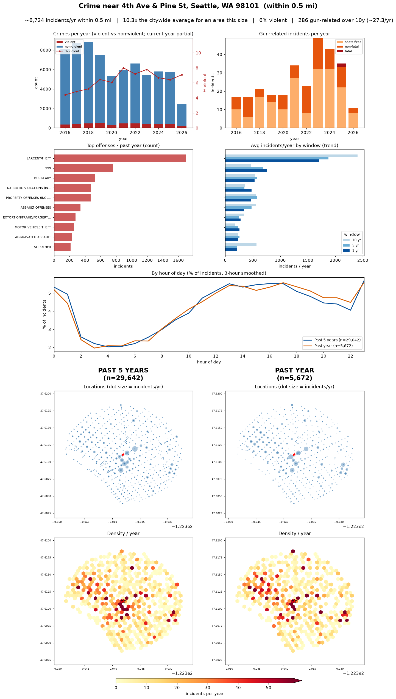
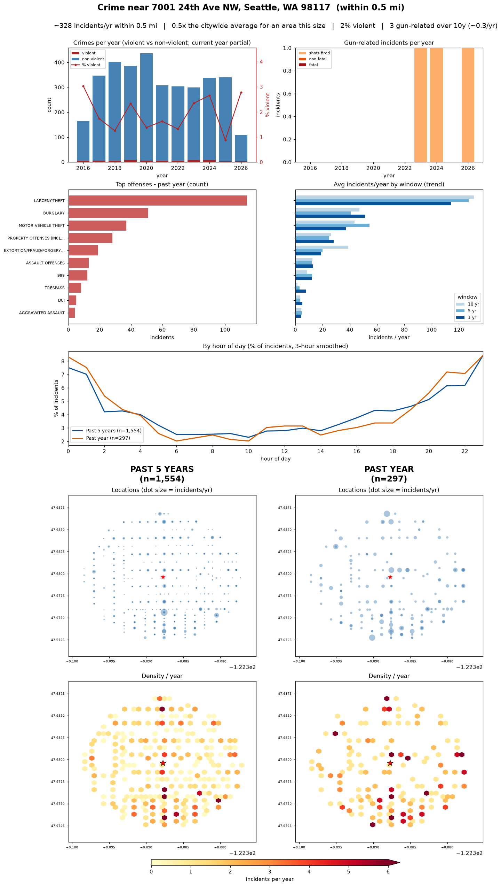

# Seattle Crime — Proximity Analysis

A small data-science notebook that explores Seattle PD crime incidents **near any
address**. You enter an address, it geocodes the location, filters every reported
crime within a chosen radius, and renders a one-page dashboard: a benchmark vs the
citywide average, crimes per year (violent vs non-violent), gun-related incidents,
top offenses with a multi-year trend, the time-of-day pattern, and
proportional-symbol + density maps comparing the **past 5 years vs the past year**.

Proximity is computed with exact great-circle (haversine) distance from the
geocoded point, not coarse beat/neighborhood polygons.

## Example output

Two extremes, a busy downtown corner vs. a quiet residential block:

**4th Ave & Pine St (Downtown)** — ~10× the citywide average for an area this size



**7001 24th Ave NW (Ballard)** — a quiet residential block



## Data

[SPD Crime Data, 2008–Present](https://data.seattle.gov/Public-Safety/SPD-Crime-Data-2008-Present/tazs-3rd5/about_data)
(City of Seattle Open Data) — ~1.5M incidents. The raw CSV is ~400 MB and is
**downloaded automatically into `data/` on first run** (it's gitignored, not
committed). Drop your own `SPD_Crime_Data*.csv` in `data/` to skip the download.

> ⚠️ **The first run is slow** — it downloads the ~340 MB+ dataset before any
> analysis happens (expect a few minutes depending on your connection). Later runs
> reuse the local file and start immediately.

## Setup

This project uses [uv](https://docs.astral.sh/uv/):

```bash
uv sync                 # install dependencies (pandas, numpy, matplotlib)
uv run jupyter lab      # then open crime_stats.ipynb
```

Or open `crime_stats.ipynb` directly in VS Code / Jupyter with the project's
`.venv` selected.

## Usage

Run the cells top to bottom. The last cell prompts you for an address — type or
paste a Seattle address and press Enter (blank = Space Needle). Set `RADIUS_MILES`
in that cell to widen or narrow the area (default `0.5`). The dashboard renders
inline and is saved to `charts/<address>.png`. To try another address, just re-run
that last cell and enter a new one.

## Notes & caveats

- **~85% of rows have usable coordinates.** Lat/long are `REDACTED` for ~14.5% of
  records, and a few are bad geocodes; those are filtered out, so counts are a
  lower bound, not a census.
- **Geocoding needs internet** (OpenStreetMap Nominatim, ≤1 req/sec per their
  [usage policy](https://operations.osmfoundation.org/policies/nominatim/)). If
  offline, set `home_lat, home_lon` manually and skip the prompt.
